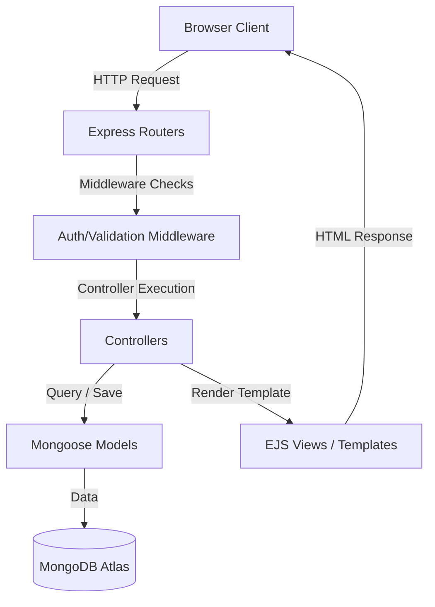

# 🌍 WanderLust

WanderLust is a full-stack, production-ready travel accommodation platform inspired by Airbnb. It allows users to explore, create, and manage unique travel listings, upload high-quality location images, and share their experiences through an interactive review system.

Built using **Node.js**, **Express**, and **MongoDB Atlas**, the project follows the **MVC (Model-View-Controller)** architecture pattern, employs strict server-side schema validations, and incorporates robust user authentication and resource authorization.

---

## 🚀 Live Demo

* **Live Site:** [wanderlust-ysw7.onrender.com](https://wanderlust-ysw7.onrender.com)
* **GitHub Repository:** [Kruthik009/WanderLust](https://github.com/Kruthik009/WanderLust)

---

## ✨ Features

* **🔐 Complete Authentication**: Secure registration, login, and logout powered by Passport.js and local authentication strategies.
* **🏠 Listings Management**: Full CRUD operations for accommodation listings:
  * Users can create new listings with titles, descriptions, pricing, locations, and countries.
  * Only the owner of a listing is authorized to update or delete it.
* **📸 Image Upload Integration**: Listing images are uploaded and stored securely in the cloud using **Cloudinary** and `multer-storage-cloudinary`.
* **⭐ Interactive Reviews**: Dynamic rating and comment section for listings:
  * Guests can leave reviews (1-5 star ratings using `starability`).
  * Authors can delete their own reviews.
* **🛡️ Security & Validations**:
  * Strict server-side schema validation using **Joi**.
  * Route protection middleware ensures actions are performed only by authenticated owners/authors.
  * Safe error-handling layout to catch runtime errors gracefully.
* **🍪 Session Management**: Secure session management using `express-session` backed by a persistent MongoDB session store (`connect-mongo`).
* **🎨 Modern Responsive UI**: Styled with **Bootstrap 5** and customized CSS with dynamic elements (interactive filters, tax switches, and elegant layouts).

---

## 🛠️ Tech Stack

| Layer | Technologies |
| --- | --- |
| **Frontend** | HTML5, CSS3, Bootstrap 5, EJS (Embedded JavaScript Templates), EJS Mate layouts |
| **Backend** | Node.js, Express.js |
| **Database** | MongoDB Atlas, Mongoose ODM |
| **Authentication** | Passport.js, Passport-Local, Passport-Local-Mongoose |
| **File Storage** | Cloudinary, Multer, Multer-Storage-Cloudinary |
| **Validation & Security** | Joi (Schema Validation), express-session, connect-mongo |

---

## 📐 MVC Architecture & Flow

The application is structured around the **Model-View-Controller** design pattern to separate concerns and ensure maintainability:



* **Models** (`models/`): Schemas for `Listing`, `Review`, and `User`.
* **Views** (`views/`): EJS templates for rendering listing pages, forms, and user auth layouts.
* **Controllers** (`controllers/`): Code managing business logic (data manipulation and handling request/response flows).
* **Routes** (`routes/`): Router modules mapping HTTP verbs and endpoints to respective controllers.

---

## 📦 Production Fixes Log (Render Deployment)

During the deployment to Render, several critical issues were resolved to ensure production stability:

1. **Mongoose 8 / Passport Compatibility**: Upgraded `passport-local-mongoose` to `8.0.0` to eliminate database crashes caused by the deprecation of callbacks in Mongoose 8's `Query.exec()`.
2. **Session Cookie Serialization**: Corrected the session expiry configuration by supplying a proper `Date` object (`new Date(Date.now() + ...)`) instead of a raw millisecond number, resolving database serialization errors.
3. **Session Store Complexity Requirements**: Removed the explicit `crypto` option from `connect-mongo` to prevent startup errors triggered by simple session secrets while keeping session transmission signed and secure.
4. **Owner/Author Verification Guards**: Added null-checking guards in listing views and controllers to handle legacy seeded listings that do not have a defined owner.

---

## 💻 Local Setup & Installation

To run this project locally on your machine, follow these steps:

### Prerequisites
* [Node.js](https://nodejs.org/) installed (v18 or higher recommended).
* A [MongoDB Atlas](https://www.mongodb.com/cloud/atlas) account (or a local MongoDB installation).
* A [Cloudinary](https://cloudinary.com/) account for image uploads.

### Setup Instructions

1. **Clone the repository:**
   ```bash
   git clone https://github.com/Kruthik009/WanderLust.git
   cd WanderLust
   ```

2. **Install dependencies:**
   ```bash
   npm install
   ```

3. **Configure Environment Variables:**
   Create a `.env` file in the root directory and add the following keys with your credentials:
   ```env
   CLOUD_NAME=your_cloudinary_cloud_name
   CLOUD_API_KEY=your_cloudinary_api_key
   CLOUD_API_SECRET=your_cloudinary_api_secret
   ATLASDB_URL=your_mongodb_connection_string
   SECRET=your_session_secret_key
   ```

4. **Initialize/Seed the Database (Optional):**
   To populate the database with default sample listings, run:
   ```bash
   node init/index.js
   ```

5. **Start the server:**
   ```bash
   npm start
   ```
   Open your browser and navigate to `http://localhost:8080`.

---

## 👨‍💻 Author

**Kruthik Pramatha**

* GitHub: [@Kruthik009](https://github.com/Kruthik009)
* Live Link: [WanderLust](https://wanderlust-ysw7.onrender.com)
